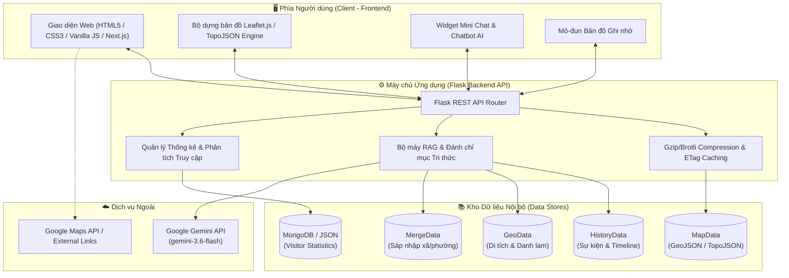
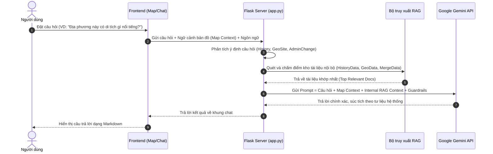

<p align="center">
  
</p>

<h1 align="center">🇻🇳 Viemap Chronicle</h1>

<p align="center">
  <strong>Hệ thống Bản đồ Số Tương tác — Khám phá Lịch sử, Địa lý & Hành chính Việt Nam theo Dòng thời gian</strong>
</p>

<p align="center">
  <a href="#-tính-năng-nổi-bật"></a>
  <a href="#-công-nghệ-sử-dụng"></a>
  <a href="#-công-nghệ-sử-dụng"></a>
  <a href="#-công-nghệ-sử-dụng"></a>
  <a href="#-hướng-dẫn-cài-đặt--chạy-dự-án"></a>
</p>

---

## 📖 Mục lục

1. [Tổng quan về Viemap Chronicle](#-tổng-quan-về-viemap-chronicle)
2. [Tính năng nổi bật](#-tính-năng-nổi-bật)
3. [Kiến trúc hệ thống & Quy trình công nghệ](#-kiến-trúc-hệ-thống--quy-trình-công-nghệ)
4. [Cấu trúc thư mục dự án](#-cấu-trúc-thư-mục-dự-án)
5. [Kho dữ liệu tri thức (Data Repositories)](#-kho-dữ-liệu-tri-thức-data-repositories)
6. [Hệ thống Trợ lý AI Viemacle (RAG + Gemini)](#-hệ-thống-trợ-lý-ai-viemacle-rag--gemini)
7. [Tài liệu API Endpoints](#-tài-liệu-api-endpoints)
8. [Công nghệ sử dụng](#-công-nghệ-sử-dụng)
9. [Hướng dẫn cài đặt & Chạy dự án](#-hướng-dẫn-cài-đặt--chạy-dự-án)
10. [Biến môi trường (Environment Variables)](#-biến-môi-trường-environment-variables)
11. [Định hướng phát triển](#-định-hướng-phát-triển)

---

## 🌟 Tổng quan về Viemap Chronicle

**Viemap Chronicle** là nền tảng web bản đồ tương tác đa thời kỳ, kết hợp giữa **Bản đồ số (GIS)**, **Kho dữ liệu Lịch sử – Địa danh – Sáp nhập hành chính** và **Trợ lý Trí tuệ nhân tạo (AI RAG)**.

Ứng dụng giúp học sinh, giáo viên, nhà nghiên cứu và người dùng quan tâm dễ dàng:
- Theo dõi sự thay đổi đường biên, địa giới hành chính qua các thời kỳ lịch sử.
- Tra cứu tức thì các thông tin sáp nhập cấp xã/phường/tỉnh theo các mốc cải cách hành chính mới nhất (2024 - 2025/2026).
- Tìm hiểu các di tích lịch sử, danh lam thắng cảnh, sự kiện gắn liền với từng mảnh đất.
- Tương tác với trợ lý AI thông minh có khả năng hiểu ngữ cảnh bản đồ (Map Context-Aware).
- Luyện tập và củng cố kiến thức vị trí địa lý thông qua trò chơi ghi nhớ tương tác.

---

## ✨ Tính năng nổi bật

### 1. 🗺️ Bản đồ tương tác đa thời kỳ (Interactive Multi-temporal Map)
- **Thanh trượt dòng thời gian (Timeline Slider):** Chuyển đổi linh hoạt giữa các mốc năm lịch sử và hiện đại; bản đồ tự động tải lại ranh giới không gian tương ứng.
- **Phân cấp hành chính:** Hỗ trợ xem linh hoạt ở các cấp độ **Tỉnh/Thành phố**, **Quận/Huyện/Thị xã**, **Xã/Phường/Thị trấn**.
- **Chế độ so sánh song song (Split Map Comparison):** Mở 2 bản đồ song song để trực tiếp đối chiếu sự thay đổi địa giới giữa 2 mốc thời gian khác nhau.
- **Tối ưu hóa hiệu năng bản đồ:** Nén dữ liệu GeoJSON/TopoJSON với ETag caching và Brotli/Gzip giúp tải mượt mà.

### 2. 🔍 Tìm kiếm thông minh (Smart Search)
- Tìm kiếm tức thì theo: Tên tỉnh/thành, quận/huyện, xã/phường, tên cũ qua các thời kỳ, di tích lịch sử, danh thắng.
- Hỗ trợ tìm kiếm không dấu, có dấu và tra cứu song ngữ (Tiếng Việt / English).
- Tự động di chuyển góc nhìn (Pan/Zoom) và làm nổi bật vùng địa lý được chọn.

### 3. 🏛️ Tra cứu thông tin Lịch sử & Danh thắng địa phương
- Xem chi tiết từng địa phương: dòng sự kiện lịch sử tiêu biểu, nguồn gốc tên gọi, di tích lịch sử - văn hóa, danh lam thắng cảnh.
- Tích hợp liên kết mở vị trí chính xác trên **Google Maps** và tìm kiếm video tư liệu.
- Bộ lọc sự kiện thông minh theo loại hình, thời kỳ và cấp hành chính.

### 4. 🔄 Tra cứu Sáp nhập & Biến động Hành chính
- Chuyên trang tra cứu sáp nhập cấp xã/phường/đơn vị hành chính mới nhất.
- Tra cứu theo tên đơn vị cũ hoặc đơn vị mới sau sáp nhập.
- Hiển thị rõ ràng nguồn gốc sáp nhập: đơn vị nào hợp nhất với đơn vị nào, thuộc quận/huyện/tỉnh nào.

### 5. 🤖 Trợ lý AI Viemacle (Map Context-Aware AI)
- Tích hợp mô hình **Google Gemini** kết hợp kỹ thuật **RAG (Retrieval-Augmented Generation)** từ kho dữ liệu nội bộ.
- **Nhận diện ngữ cảnh bản đồ:** Khi người dùng chọn một vùng trên bản đồ và hỏi *"Nơi này có sự kiện gì tiêu biểu?"*, AI tự động nhận biết vị trí đang chọn để trả lời chính xác.
- **Hệ thống Guardrail an toàn:** Tự động cảnh báo phạm vi dữ liệu và từ chối khéo léo các câu hỏi ngoài phạm vi (Toán, Lý, Hóa, Tin học, Chính trị ngoài lề...).
- Hỗ trợ cả giao diện Chatbot toàn màn hình (có quản lý lịch sử trò chuyện) và Widget Mini Chat thu nhỏ có thể kéo thả/thay đổi kích thước ngay trên bản đồ.

### 6. 🧩 Trò chơi Bản đồ Ghi nhớ (Memory Map Quiz)
- Trò chơi trắc nghiệm tương tác giúp rèn luyện khả năng nhận biết vị trí địa lý.
- 2 chế độ luyện tập: **Chọn trực tiếp trên bản đồ** và **Trắc nghiệm hình dạng tỉnh**.
- Phân chia câu hỏi theo vùng miền: Toàn quốc, Miền Bắc, Miền Trung, Miền Nam.
- Hệ thống tính điểm, chuỗi trả lời đúng (streak), gợi ý thông minh và lưu kỷ lục (High Score).

### 7. 📄 Xuất báo cáo địa phương (Export Dossier)
- Xuất hồ sơ tổng hợp địa phương với đầy đủ lịch sử, địa danh và biến động hành chính dưới các định dạng:
  - **JSON:** Thuận tiện lưu trữ và lập trình mở rộng.
  - **PNG:** Hình ảnh trực quan dùng để thuyết trình, chia sẻ.
  - **PDF:** Tài liệu học tập, in ấn và báo cáo.

### 8. 🌐 Trải nghiệm người dùng & Tiện ích mở rộng
- **Song ngữ VI / EN:** Dễ dàng chuyển đổi ngôn ngữ giao diện và nội dung.
- **Bookmark & History:** Lưu lại các địa phương quan tâm và xem lịch sử truy cập gần đây.
- **Interactive Quick Tour:** Chuyến tham quan có chỉ dẫn trực quan cho người dùng lần đầu truy cập.
- **Admin Dashboard:** Thống kê lượt truy cập, người dùng duy nhất, lịch sử truy cập thời gian thực (hỗ trợ MongoDB).

---

## 🏗️ Kiến trúc hệ thống & Quy trình công nghệ

Viemap Chronicle hoạt động theo mô hình Client-Server hiện đại, kết hợp xử lý dữ liệu không gian và AI RAG pipeline:



---

## 📁 Cấu trúc thư mục dự án

```text
Viemap/
├── app.py                      # File khởi chạy ứng dụng Flask, chứa toàn bộ API & RAG Engine
├── requirements.txt            # Danh sách các thư viện phụ thuộc Python
├── vercel.json                 # Cấu hình triển khai máy chủ Serverless Vercel
├── .env                        # File biến môi trường cấu hình API Key & Cổng
│
├── templates/                  # Giao diện HTML Template
│   ├── index.html              # Giao diện chính của ứng dụng Viemap Chronicle
│   └── admin.html              # Bảng điều khiển quản trị thống kê
│
├── static/                     # Tài nguyên tĩnh
│   ├── style.css               # Phong cách thiết kế giao diện Glassmorphism & Responsive
│   ├── app.js                  # Toàn bộ logic tương tác phía Frontend, Leaflet & Quiz
│   ├── logo.jpg                # Logo thương hiệu ứng dụng
│   └── favicon.ico             # Biểu tượng tab trình duyệt
│
├── frontend/                   # Ứng dụng Frontend mở rộng xây dựng bằng Next.js (React/TS/Tailwind)
│   ├── src/
│   ├── package.json
│   └── tsconfig.json
│
├── MapData/                    # Kho dữ liệu bản đồ địa lý theo từng mốc năm
│   ├── vn_*.geojson            # Ranh giới hành chính cấp Tỉnh, Huyện, Xã các năm
│   └── ...
│
├── HistoryData/                # Kho dữ liệu lịch sử địa phương
│   ├── *.json                  # Dữ liệu sự kiện lịch sử từng tỉnh/thành (VI & EN)
│   ├── timeline_index.json     # Mốc biến động hành chính trọng điểm
│   └── MergeData/              # Dữ liệu sáp nhập đơn vị hành chính cấp xã/phường
│       └── *.json              # Danh mục sáp nhập của 63 tỉnh/thành
│
├── GeoData/                    # Kho dữ liệu địa danh, di tích, danh thắng
│   └── *.json                  # Dữ liệu di tích, thắng cảnh của từng địa phương
│
├── normalize_merge_data.py     # Tiện ích chuẩn hóa dữ liệu sáp nhập
├── update_to_province.py       # Tiện ích đồng bộ hóa tên tỉnh/thành
└── visitor_stats.json          # Bộ nhớ đệm lưu thống kê lượt truy cập
```

---

## 📚 Kho dữ liệu tri thức (Data Repositories)

| Thư mục | Định dạng | Nội dung chi tiết |
| :--- | :--- | :--- |
| **`MapData/`** | `.geojson`, `.topojson` | Tọa độ đa giác phân định ranh giới các đơn vị hành chính Việt Nam qua các mốc lịch sử. |
| **`HistoryData/`** | `.json` | Các sự kiện lịch sử tiêu biểu, nhân vật, bối cảnh thời gian của 63 tỉnh/thành. |
| **`HistoryData/MergeData/`** | `.json` | Thông tin chi tiết các đề án sắp xếp, sáp nhập xã, phường, thị trấn (đơn vị cũ ➡️ đơn vị mới). |
| **`GeoData/`** | `.json` | Danh mục địa danh, danh lam thắng cảnh, di tích lịch sử văn hóa cấp quốc gia và quốc tế kèm tọa độ. |

---

## 🧠 Hệ thống Trợ lý AI Viemacle (RAG + Gemini)

Trợ lý ảo **Viemacle** được trang bị kiến trúc **RAG (Retrieval-Augmented Generation)** nhiều tầng:



### Điểm đặc biệt của Viemacle:
1. **Ưu tiên dữ liệu nội bộ:** Trả lời chính xác thông tin địa phương dựa trên dữ liệu lịch sử và sáp nhập thực tế của hệ thống.
2. **Nhận biết ngữ cảnh địa lý:** Hiểu các đại từ chỉ định (*"ở đây"*, *"tỉnh này"*, *"sau sáp nhập"*) dựa vào vùng người dùng đang chọn trên bản đồ.
3. **Cơ chế an toàn (Guardrails):** Tự động gắn nhãn cảnh báo nếu câu hỏi nằm ngoài cơ sở dữ liệu nội bộ và từ chối các câu hỏi không thuộc phạm vi chủ đề dự án.

---

## 📡 Tài liệu API Endpoints

Máy chủ Flask cung cấp hệ thống REST API đầy đủ cho ứng dụng:

### 1. Cấu hình & Bản đồ
- `GET /api/config?lang=vi|en`: Lấy danh sách các mốc năm và các file bản đồ sẵn có.
- `GET /api/map/<filename>`: Tải file GeoJSON/TopoJSON tương ứng (hỗ trợ ETag, Gzip/Brotli).

### 2. Dữ liệu Lịch sử & Địa danh
- `GET /api/history/<filename>?lang=vi|en`: Lấy dữ liệu sự kiện lịch sử theo tỉnh/thành.
- `GET /api/geodata/<filename>?lang=vi|en`: Lấy dữ liệu danh lam thắng cảnh, di tích theo tỉnh/thành.
- `GET /api/merger/communes?lang=vi|en`: Lấy toàn bộ dữ liệu sáp nhập xã/phường trên toàn quốc.
- `GET /api/report/province?name=<tên_tỉnh>&lang=vi|en`: Tổng hợp toàn bộ sự kiện, danh thắng và biến động hành chính của 1 tỉnh.

### 3. Tìm kiếm & Trợ lý AI
- `GET /api/search?q=<từ_khóa>&limit=12&lang=vi|en`: Tìm kiếm đa năng trong kho tài liệu RAG.
- `POST /api/chat`: Gửi câu hỏi đến Trợ lý AI Viemacle.
  - **Body (JSON):**
    ```json
    {
      "message": "Quảng Nam có những di tích nào?",
      "session_id": "uuid-v4-session-id",
      "map_context": {
        "name": "Quảng Nam",
        "level": "province",
        "year": 2025
      },
      "lang": "vi",
      "reset": false
    }
    ```

### 4. Quản trị & Thống kê
- `GET /api/admin/stats`: Lấy thống kê tổng lượt truy cập, truy cập hôm nay, người dùng duy nhất và danh sách IP.
- `POST /api/admin/reset-stats`: Đặt lại số liệu thống kê (yêu cầu xác thực).

---

## 💻 Công nghệ sử dụng

### Phía Frontend
- **Ngôn ngữ:** HTML5, CSS3 (Custom Glassmorphism, CSS Grid, Flexbox), JavaScript (ES6+).
- **Thư viện Bản đồ:** [Leaflet.js](https://leafletjs.com/), [TopoJSON Client](https://github.com/topojson/topojson-client).
- **Mở rộng Hiện đại:** [Next.js 14](https://nextjs.org/) (React 18, TypeScript, TailwindCSS, Lucide Icons).
- **Hiển thị & Biểu tượng:** Font Awesome 6, Marked.js (Markdown parser).

### Phía Backend & AI
- **Ngôn ngữ:** Python 3.10+.
- **Web Framework:** [Flask](https://flask.palletsprojects.com/), Flask-CORS, Flask-Compress.
- **Trí tuệ nhân tạo:** [Google GenAI SDK](https://github.com/google/generative-ai-python) (`gemini-3.6-flash`).
- **Cơ sở dữ liệu & Thống kê:** JSON Stores, [MongoDB](https://www.mongodb.com/) (thông qua PyMongo / dnspython).

---

## 🚀 Hướng dẫn cài đặt & Chạy dự án

### Yêu cầu hệ thống
- Đã cài đặt **Python 3.10** trở lên.
- Đã cài đặt **Node.js 18+** (nếu muốn chạy phiên bản giao diện Next.js).
- Có kết nối Internet (để tải bản đồ nền và gọi Google Gemini API).

### Các bước cài đặt

#### 1. Clone mã nguồn dự án
```bash
git clone https://github.com/CAZRALO/ViemapChronicle.git
cd Viemap
```

#### 2. Khởi tạo môi trường ảo Python
- **Trên Windows:**
  ```powershell
  python -m venv .venv
  .\.venv\Scripts\activate
  ```
- **Trên macOS / Linux:**
  ```bash
  python3 -m venv .venv
  source .venv/bin/activate
  ```

#### 3. Cài đặt các thư viện phụ thuộc
```bash
pip install -r requirements.txt
```

#### 4. Cấu hình biến môi trường
Tạo file `.env` tại thư mục gốc của dự án:
```env
GOOGLE_API_KEY=your_gemini_api_key_here
PORT=5050
MONGODB_URI=your_mongodb_connection_string_optional
```

#### 5. Khởi chạy máy chủ ứng dụng
```bash
python app.py
```
Sau khi khởi chạy thành công, mở trình duyệt web và truy cập:
👉 **`http://localhost:5050`** hoặc **`http://127.0.0.1:5050`**

*(Tùy chọn)* Nếu muốn chạy giao diện Next.js trong thư mục `frontend`:
```bash
cd frontend
npm install
npm run dev
```
Truy cập: **`http://localhost:3000`**

---

## ⚙️ Biến môi trường (Environment Variables)

| Tên biến | Bắt buộc | Mô tả |
| :--- | :---: | :--- |
| `GOOGLE_API_KEY` | **Có** | API Key từ Google AI Studio để vận hành Trợ lý AI Viemacle. |
| `PORT` | Không | Cổng dịch vụ Flask (mặc định: `5050`). |
| `MONGODB_URI` | Không | Chuỗi kết nối MongoDB để lưu trữ dữ liệu thống kê khách truy cập trực tuyến. |

---

## 🎯 Định hướng phát triển

- [x] Tích hợp bản đồ hành chính đa thời kỳ và phân cấp Tỉnh/Huyện/Xã.
- [x] Tích hợp Trợ lý AI Viemacle với cơ chế RAG nội bộ và nhận biết ngữ cảnh bản đồ.
- [x] Chế độ xem so sánh 2 mốc năm song song (Split Map).
- [x] Trò chơi Ghi nhớ bản đồ và trắc nghiệm hình dạng tỉnh.
- [x] Hỗ trợ xuất báo cáo địa phương dạng JSON/PNG/PDF.
- [ ] Bổ sung thêm các mốc bản đồ lịch sử thời kỳ phong kiến và kháng chiến.
- [ ] Xây dựng công cụ tạo bài giảng và phiếu bài tập trực quan cho giáo viên lịch sử - địa lý.
- [ ] Hỗ trợ mô hình 3D cho các di tích lịch sử và danh lam thắng cảnh tiêu biểu.

---

<p align="center">
  Được phát triển với niềm đam mê dành cho Lịch sử, Địa lý và Công nghệ Việt Nam 🇻🇳<br>
  <strong>Viemap Chronicle Team</strong>
</p>